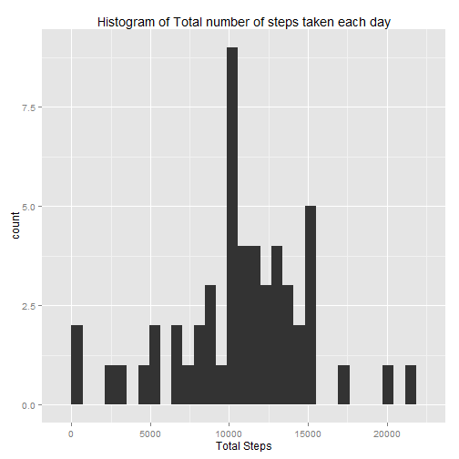
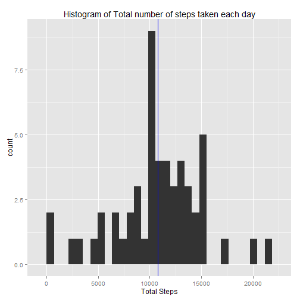
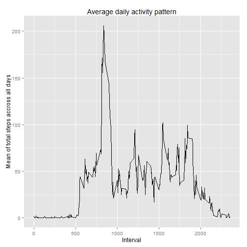
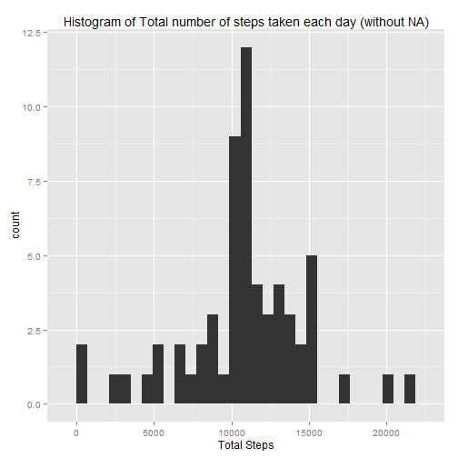
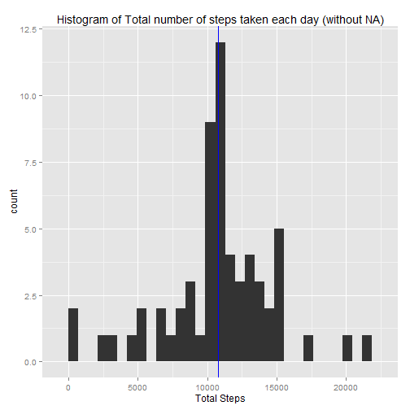
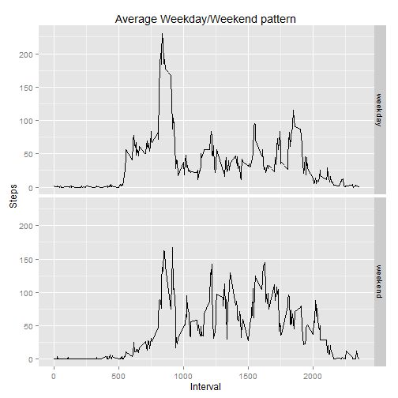

```r
library (ggplot2)
```
---
title: "PA1_template.Rmd"
author: "Mathieu Ah-Sing"
date: "Sunday, June 07, 2015"
output: html_document
---

This is "Reproducible Research" Peer Assessment n°1.

The goal of the project is to make student use R markdown.

Data was given by the course by following this URL : [Activity monitoring data](https://d396qusza40orc.cloudfront.net/repdata%2Fdata%2Factivity.zip)

The following questions must be answered :

1. What is mean total number of steps taken per day?

2. What is the average daily activity pattern?

3. Imputing missing values

4. Are there differences in activity patterns between weekdays and weekends?

5. Submitting the Assignment


#Before answering the questions, let's look the data first


```r
myData <-read.csv(file=unzip("repdata_data_activity.zip"), header=TRUE, sep=",")
str(myData)
```

```
## 'data.frame':	17568 obs. of  3 variables:
##  $ steps   : int  NA NA NA NA NA NA NA NA NA NA ...
##  $ date    : Factor w/ 61 levels "2012-10-01","2012-10-02",..: 1 1 1 1 1 1 1 1 1 1 ...
##  $ interval: int  0 5 10 15 20 25 30 35 40 45 ...
```

```r
head(myData)
```

```
##   steps       date interval
## 1    NA 2012-10-01        0
## 2    NA 2012-10-01        5
## 3    NA 2012-10-01       10
## 4    NA 2012-10-01       15
## 5    NA 2012-10-01       20
## 6    NA 2012-10-01       25
```

```r
tail(myData) 
```

```
##       steps       date interval
## 17563    NA 2012-11-30     2330
## 17564    NA 2012-11-30     2335
## 17565    NA 2012-11-30     2340
## 17566    NA 2012-11-30     2345
## 17567    NA 2012-11-30     2350
## 17568    NA 2012-11-30     2355
```

```r
nrow(myData)
```

```
## [1] 17568
```

```r
ncol(myData)
```

```
## [1] 3
```

```r
colnames(myData)
```

```
## [1] "steps"    "date"     "interval"
```

```r
sum(is.na(myData$steps))
```

```
## [1] 2304
```

```r
sum(is.na(myData$date))
```

```
## [1] 0
```

```r
sum(is.na(myData$interval))
```

```
## [1] 0
```
Ok, it means only the column "steps" contains many NAs.


Let is just transform the "date" column to a real date format (not factor)


```r
myData$date <- as.Date(myData$date, format="%Y-%m-%d") 
str(myData)
```

```
## 'data.frame':	17568 obs. of  3 variables:
##  $ steps   : int  NA NA NA NA NA NA NA NA NA NA ...
##  $ date    : Date, format: "2012-10-01" "2012-10-01" ...
##  $ interval: int  0 5 10 15 20 25 30 35 40 45 ...
```

Now we could begin answering the questions


## Question 1. What is mean total number of steps taken per day?
###1. Calculate the total number of steps taken per day

```r
aggregate(x=myData$steps, by=list(myData$date), FUN=sum)
```

```
##       Group.1     x
## 1  2012-10-01    NA
## 2  2012-10-02   126
## 3  2012-10-03 11352
## 4  2012-10-04 12116
## 5  2012-10-05 13294
## 6  2012-10-06 15420
## 7  2012-10-07 11015
## 8  2012-10-08    NA
## 9  2012-10-09 12811
## 10 2012-10-10  9900
## 11 2012-10-11 10304
## 12 2012-10-12 17382
## 13 2012-10-13 12426
## 14 2012-10-14 15098
## 15 2012-10-15 10139
## 16 2012-10-16 15084
## 17 2012-10-17 13452
## 18 2012-10-18 10056
## 19 2012-10-19 11829
## 20 2012-10-20 10395
## 21 2012-10-21  8821
## 22 2012-10-22 13460
## 23 2012-10-23  8918
## 24 2012-10-24  8355
## 25 2012-10-25  2492
## 26 2012-10-26  6778
## 27 2012-10-27 10119
## 28 2012-10-28 11458
## 29 2012-10-29  5018
## 30 2012-10-30  9819
## 31 2012-10-31 15414
## 32 2012-11-01    NA
## 33 2012-11-02 10600
## 34 2012-11-03 10571
## 35 2012-11-04    NA
## 36 2012-11-05 10439
## 37 2012-11-06  8334
## 38 2012-11-07 12883
## 39 2012-11-08  3219
## 40 2012-11-09    NA
## 41 2012-11-10    NA
## 42 2012-11-11 12608
## 43 2012-11-12 10765
## 44 2012-11-13  7336
## 45 2012-11-14    NA
## 46 2012-11-15    41
## 47 2012-11-16  5441
## 48 2012-11-17 14339
## 49 2012-11-18 15110
## 50 2012-11-19  8841
## 51 2012-11-20  4472
## 52 2012-11-21 12787
## 53 2012-11-22 20427
## 54 2012-11-23 21194
## 55 2012-11-24 14478
## 56 2012-11-25 11834
## 57 2012-11-26 11162
## 58 2012-11-27 13646
## 59 2012-11-28 10183
## 60 2012-11-29  7047
## 61 2012-11-30    NA
```
Ok, but let s make a little test about the dataset. What does these "NAs" mean ?
Let s take for example the first day results with "NA" (2012-10-01)


```r
nrow(myData[myData$date=="2012-10-01",])
```

```
## [1] 288
```

```r
sum(is.na(myData[myData$date=="2012-10-01",]))
```

```
## [1] 288
```

According to the dataset, some runner didn t make any steps during a day...

That is ok for me folks, but do not wear the meter this day please, you are tydiing my dataset !!

###2. If you do not understand the difference between a histogram and a barplot, research the difference between them. Make a histogram of the total number of steps taken each day


```r
myPlot1 <- aggregate(x=myData$step, by=list(myData$date),  FUN=sum)
colnames(myPlot1) <- c("date", "TotalSteps")

a <- ggplot(myPlot1, aes(x=myPlot1$TotalSteps)) + geom_histogram()
a <- a + ggtitle("Histogram of Total number of steps taken each day")
a <- a + xlab("Total Steps")
plot(a)
```

 


###3. Calculate and report the mean and median of the total number of steps taken per day

```r
histMean <- mean(myPlot1$TotalSteps, na.rm=TRUE)
histMedian <- median(myPlot1$TotalSteps, na.rm=TRUE)
a <- a + geom_vline(xintercept=histMean, color="red")
a <- a + geom_vline(xintercept=histMedian, color="blue")
histMean
```

```
## [1] 10766.19
```

```r
histMedian
```

```
## [1] 10765
```

```r
plot(a)
```

 

We used na.rm, so rows with NA were entirely removed before calculating mean and median
The mean and the median are nearly the same

## Question 2 What is the average daily activity pattern?
###1. Make a time series plot (i.e. type = "l") of the 5-minute interval (x-axis) and the average number of steps taken, averaged across all days (y-axis)

Firstly, aggregate Total Steps by making a mean accross all days

```r
myPlot2 <- aggregate(x=myData$step, by=list(myData$interval), FUN=mean, na.rm=TRUE)
colnames(myPlot2) <- c("Interval", "TotalStepsMean")
```

Secondly, make a beautiful plot

```r
b <- ggplot(myPlot2, aes(myPlot2$Interval, y=myPlot2$TotalStepsMean))
b <- b + xlab("Interval") 
b <- b + ylab("Mean of total steps accross all days")
b <- b + ggtitle("Average daily activity pattern")
b <- b + geom_line()
plot(b)
```

 

###2. Which 5-minute interval, on average across all the days in the dataset, contains the maximum number of steps?

```r
myPlot2[myPlot2$TotalStepsMean==max(myPlot2$TotalStepsMean),]
```

```
##     Interval TotalStepsMean
## 104      835       206.1698
```
## Question 3 Imputing missing values


Note that there are a number of days/intervals where there are missing values (coded as NA). The presence of missing days may introduce bias into some calculations or summaries of the data.

###3.1 Calculate and report the total number of missing values in the dataset (i.e. the total number of rows with NAs)


```r
sum(is.na(myData$steps))
```

```
## [1] 2304
```


###3.2 Devise a strategy for filling in all of the missing values in the dataset. The strategy does not need to be sophisticated. For example, you could use the mean/median for that day, or the mean for that 5-minute interval, etc.

My Strategy :

1. Calculate the mean of that day for the interval (already done in myPlot2)

2. Replace the Na by the mean of the day

###3.3 Create a new dataset that is equal to the original dataset but with the missing data filled in. 


```r
myData2 <- myData
for(i in 1:nrow(myData2))
{
  if (is.na(myData2$steps[i])){
    # if NA, go search the mean value which is in myPlot2 with the same interval 
    myData2$steps[i] <- myPlot2[myPlot2$Interval==myData2$interval[i], 2]
    #print(myPlot2[myPlot2$Interval==myData2$interval[i], 2])
  }
  else
  {
    #Nothing
  }
}
```

###3.4.1 Make a histogram of the total number of steps taken each day 
Making the same steps of myData but with myData2 (which contains no NA)

```r
myPlot3 <- aggregate(x=myData2$step, by=list(myData2$date),  FUN=sum)
colnames(myPlot3) <- c("date", "TotalSteps")

a2 <- ggplot(myPlot3, aes(x=myPlot3$TotalSteps)) + geom_histogram()
a2 <- a2 + ggtitle("Histogram of Total number of steps taken each day (without NA)")
a2 <- a2 + xlab("Total Steps")
plot(a2)
```

 

###3.4.2 and Calculate and report the mean and median total number of steps taken per day. 

```r
histMean2 <- mean(myPlot3$TotalSteps, na.rm=TRUE)
histMedian2 <- median(myPlot3$TotalSteps, na.rm=TRUE)
a2 <- a2 + geom_vline(xintercept=histMean2, color="red")
a2 <- a2 + geom_vline(xintercept=histMedian2, color="blue")
histMean2
```

```
## [1] 10766.19
```

```r
histMedian2
```

```
## [1] 10766.19
```

```r
plot(a2)
```

 

###3.5 Do these values differ from the estimates from the first part of the assignment? 

No, the means and medians are fairly the same between myData with and without NA

With NA :


```r
histMean
```

```
## [1] 10766.19
```

```r
histMedian
```

```
## [1] 10765
```

Without NA :


```r
histMean2
```

```
## [1] 10766.19
```

```r
histMedian2
```

```
## [1] 10766.19
```

###3.6 What is the impact of imputing missing data on the estimates of the total daily number of steps?

The total daily number of steps increase by imputing missing data 


```r
sum(myPlot1$TotalSteps, na.rm=TRUE)
```

```
## [1] 570608
```

```r
sum(myPlot3$TotalSteps, na.rm=TRUE)
```

```
## [1] 656737.5
```

##Question 4 Are there differences in activity patterns between weekdays and weekends?

  For this part the weekdays() function may be of some help here. Use the dataset with the filled-in missing values for this part.

### 4.1 Create a new factor variable in the dataset with two levels - "weekday" and "weekend" indicating whether a given date is a weekday or weekend day.


```r
for(i in 1:nrow(myData2))
{
  numWeekDay <- as.numeric(format(myData2$date[i], "%u"))
  if (1 == numWeekDay) { myData2$weekday[i] <- "weekday"}
  if (2 == numWeekDay) { myData2$weekday[i] <- "weekday"}
  if (3 == numWeekDay) { myData2$weekday[i] <- "weekday"}
  if (4 == numWeekDay) { myData2$weekday[i] <- "weekday"}
  if (5 == numWeekDay) { myData2$weekday[i] <- "weekday"}
  if (6 == numWeekDay) { myData2$weekday[i] <- "weekend"}
  if (7 == numWeekDay) { myData2$weekday[i] <- "weekend"}
  #print(numWeekDay)
}
```

### 4.2 Make a panel plot containing a time series plot (i.e. type = "l") of the 5-minute interval (x-axis) and the average number of steps taken, averaged across all weekday days or weekend days (y-axis). 
  See the README file in the GitHub repository to see an example of what this plot should look like using simulated data.


```r
myPlot4 <- aggregate(x=myData2$step, by=list(myData2$weekday,myData2$interval),  FUN=mean, na.rm=TRUE)
colnames(myPlot4) <- c("weekday", "interval", "steps")

c <- ggplot(data=myPlot4, aes(x=interval, y=steps))
c <- c + xlab("Interval") 
c <- c + ylab("Steps")
c <- c + ggtitle("Average Weekday/Weekend pattern")
c <- c + geom_line()
c <- c + facet_grid(weekday~.)
plot(c)
```

 
